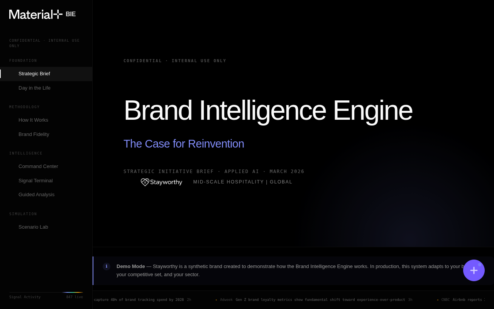
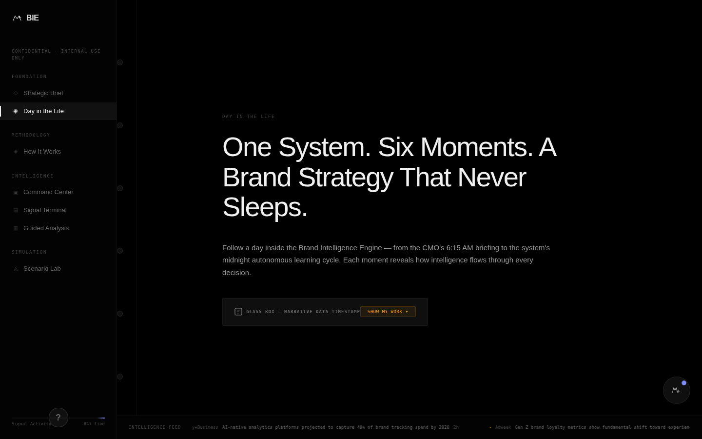
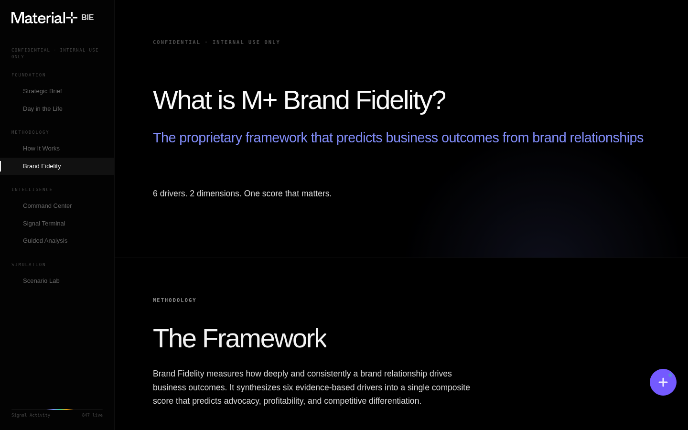
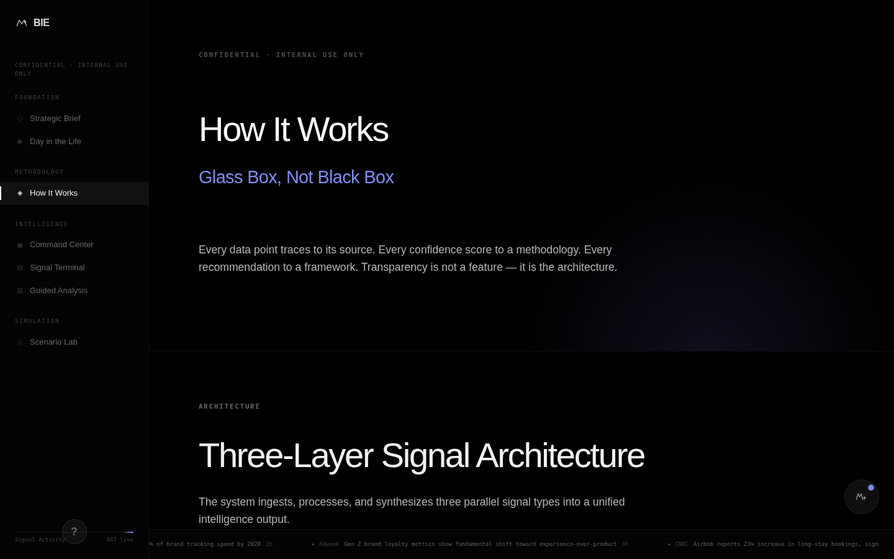
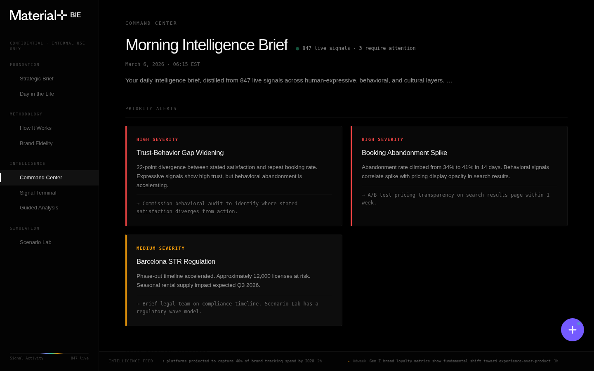
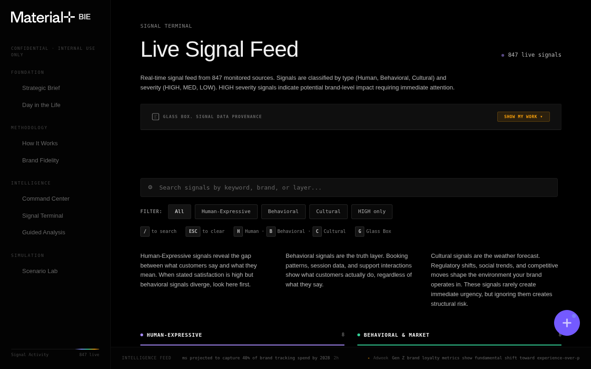
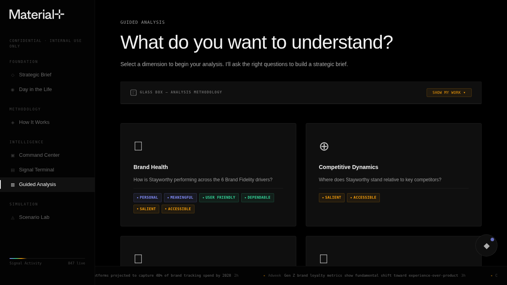
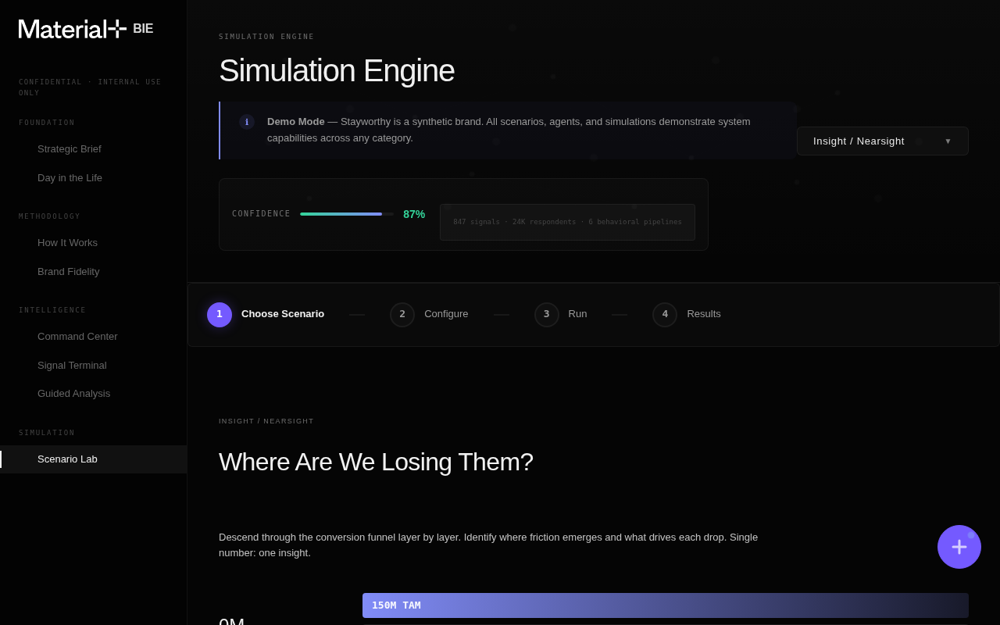

# Brand Intelligence Engine v9

**A multi-signal brand intelligence platform that continuously monitors, analyzes, and surfaces brand health insights — built for the March 19, 2026 board presentation.**

> Every claim has a source. Every source has a confidence score. Every score has a methodology. **Glass Box, Not Black Box.**



---

## What This Is

The Brand Intelligence Engine (BIE) replaces traditional quarterly brand tracking with a **continuous, multi-signal intelligence system**. It ingests three parallel signal streams — what people *say* (Human-Expressive), what people *do* (Behavioral), and what the world *does around them* (Cultural) — and synthesizes them into a unified Brand Score across six loyalty drivers.

This repo contains the **interactive prototype** — 8 interconnected HTML surfaces that demonstrate the platform's architecture, data model, and UX vision using Stayworthy (fictional short-term rental brand) as the client case.

### Three Things That Set This Apart

1. **Multi-Signal Intelligence** — We don't ask "what do you think?" and stop. We triangulate what people say, what they do, and what the world is doing around them.
2. **Continuous Learning** — Not quarterly waves. Not annual studies. A system that learns every day, surfaces what matters now.
3. **Glass Box Transparency** — Every claim traces to a named source, a documented methodology, and a confidence score. No exceptions.

---

## Surfaces

| Surface | File | Purpose |
|---------|------|---------|
| **Strategic Brief** | `index.html` | Executive overview — the case for reinvention |
| **Day in the Life** | `day-in-the-life.html` | Cinematic scrollytelling — 6 moments from dawn to midnight |
| **Brand Score** | `brand-fidelity.html` | Six-driver framework — In the Moment + Over Time |
| **How It Works** | `how-it-works.html` | Glass Box methodology — architecture, confidence, sources |
| **Command Center** | `command-center.html` | Morning intelligence brief — composite score, radar, alerts |
| **Signal Terminal** | `signal-terminal.html` | Live signal feed — filterable by type, severity, brand |
| **Guided Analysis** | `guided-analysis.html` | AI-assisted analysis — structured questions, driver exploration |
| **Scenario Lab** | `scenario-lab.html` | Simulation engine — funnels, war gaming, focus groups, Brand Score LIVE |

---

## Screenshots

<details>
<summary>Strategic Brief — The Case for Reinvention</summary>


</details>

<details>
<summary>Day in the Life — Dawn to Midnight Intelligence</summary>


</details>

<details>
<summary>Brand Score — Six Drivers of Brand Truth</summary>


</details>

<details>
<summary>How It Works — Glass Box Architecture</summary>


</details>

<details>
<summary>Command Center — Morning Intelligence Brief</summary>


</details>

<details>
<summary>Signal Terminal — Live Feed</summary>


</details>

<details>
<summary>Guided Analysis — AI-Assisted Exploration</summary>


</details>

<details>
<summary>Scenario Lab — Simulation & Brand Score LIVE</summary>


</details>

---

## Quick Start

```bash
# Clone the repo
git clone git@github.com:carlton-material/bie-v9.git
cd bie-v9

# Serve locally (any static server works)
python3 -m http.server 8090

# Open in browser
open http://localhost:8090
```

No build step. No dependencies. Pure HTML/CSS/JS.

---

## Architecture

```
bie-v9/
├── index.html                 # Strategic Brief (entry point)
├── day-in-the-life.html       # Cinematic scrollytelling
├── brand-fidelity.html        # Brand Score framework
├── how-it-works.html          # Glass Box methodology
├── command-center.html        # Morning intelligence brief
├── signal-terminal.html       # Live signal feed
├── guided-analysis.html       # AI-assisted analysis
├── scenario-lab.html          # Simulation engine (4 tabs)
├── css/
│   ├── tokens.css             # Design tokens — colors, fonts, spacing
│   ├── global.css             # Layout, nav, typography, ticker
│   ├── components.css         # Cards, badges, charts, panels
│   └── glass-box.css          # Glass Box transparency system
├── js/
│   ├── app.js                 # Core — nav, Material Analyst, Glass Box
│   ├── analyst-llm.js         # Claude Haiku LLM integration
│   ├── api-client.js          # RSS feed client (5 sources)
│   └── brand-sim.js           # Agent-based simulation engine (650 agents)
├── data/
│   ├── stayworthy.json        # Client brand data
│   ├── brands.json            # Competitive set definitions
│   ├── brand-sim-config.json  # Simulation parameters
│   ├── signals-metadata.json  # Signal source definitions
│   └── synthetic-cohorts.json # Simulation cohort data
├── assets/
│   ├── logos/                 # Brand marks (Material+, Stayworthy)
│   └── images/                # Framework diagrams
└── docs/
    ├── screenshots/           # QA captures for all 8 surfaces
    ├── DATA-EXTENSIBILITY.md  # Multi-brand architecture ADR
    ├── ARCHITECTURE.md        # System design reference
    └── VISION.md              # Product direction & strategy
```

### Design System

- **6-tier black stack**: `#000000` → `#030303` → `#050505` → `#0a0a0a` → `#0f0f0f` → `#141414`
- **3 signal colors ONLY**: Human-Expressive `#818cf8` · Behavioral `#34d399` · Cultural `#f59e0b`
- **3-font system**: Space Grotesk (display) · Inter (body) · JetBrains Mono (data/labels)
- **Brand purple** `#745AFF`: Logo accent only — never used for data

### Data Model

**Brand Score — 6 Drivers of Loyalty**

| Dimension | Driver | Score | Δ |
|-----------|--------|-------|---|
| In the Moment | User Friendly | 72 | -4 |
| In the Moment | Personal | 64 | -8 |
| In the Moment | Accessible | 71 | +1 |
| Over Time | Dependable | 58 | -6 |
| Over Time | Meaningful | 66 | -3 |
| Over Time | Salient | 74 | +2 |
| **Composite** | | **72** | **-4** |

**Signal-to-Driver Mapping**
- Human-Expressive → Personal, Meaningful
- Behavioral → User Friendly, Dependable
- Cultural → Salient, Accessible

**Source Tier Weightage**: Primary 40% · Secondary 30% · Tertiary 20% · Internal 10%

---

## Material Analyst

The Material Analyst is an AI chat panel present on every surface, powered by Claude Haiku. It operates in two modes:

**Ask Mode** — Socratic questioning. The analyst guides the user through structured discovery, asking clarifying questions about the brand, the customer, and the implications of the data. Each follow-up is contextual to the surface and the user's previous responses.

**Explore Mode** — Diagnostic analysis. The analyst identifies patterns, anomalies, and opportunities in the Brand Score drivers and signals. It highlights weak spots (Dependable at 58), correlations (Personal declining -8 while Salient rises +2), and actionable insights tied to data sources.

Both modes operate on a tiered conversation system with intelligent fallbacks. If the LLM times out or fails, the analyst degrades gracefully to static guidance cards with the same Socratic and diagnostic structure, ensuring the surface remains functional during board presentations.

---

## Design Principles

Informed by our R&D architecture discussions, this project embodies:

### Pits of Success
> "Creating a process that allows people to succeed even despite themselves."

The codebase uses shared CSS tokens, a single JS module (`app.js`), and consistent HTML patterns so any surface can be extended without breaking others. New surfaces follow the same template: import the 4 CSS files, import `app.js`, wrap content in `.app > .sidebar + .app-content`.

### Context Rot Prevention
> "When the context grows too big... it leads to the hallucinations you were trying to avoid."

Each surface is self-contained in a single HTML file with inline `<style>` for page-specific CSS. Shared system styles live in `css/`. Data lives in `data/`. No build pipeline to rot. No framework versions to drift. The simplest possible architecture that could work.

### Atomic Units of Implementation
Every feature maps to a discrete, verifiable unit: one Glass Box panel, one Scenario Lab tab, one signal filter. Each can be tested independently. Each has clear acceptance criteria visible in the UI itself.

---

## Key Documents

- **[ARCHITECTURE.md](docs/ARCHITECTURE.md)** — System design, module dependencies, Glass Box mechanics
- **[VISION.md](docs/VISION.md)** — Product strategy, roadmap, and long-term direction
- **[DATA-EXTENSIBILITY.md](docs/DATA-EXTENSIBILITY.md)** — Multi-brand support architecture and data schema ADR
- **[CONTRIBUTING.md](CONTRIBUTING.md)** — Development workflow, testing, and submission guidelines
- **[ONBOARDING.md](ONBOARDING.md)** — New team member setup and codebase orientation

---

## Contributing

### Branch Conventions
```
feature/descriptive-name    # New features
fix/issue-description       # Bug fixes
refine/surface-name         # Visual refinements
sprint/sprint-number        # Sprint bundles
```

### Commit Message Format
```
type(scope): description

feat(signal-nexus): add 3-panel layout with trajectory charts
fix(command-center): correct Brand Score composite count-up animation
refine(ditl): elevate scroll-triggered scene reveals
docs(readme): add architecture section and screenshots
```

### PR Checklist
- [ ] Zero JS console errors across all 8 surfaces
- [ ] All Glass Box toggles functional
- [ ] All navigation links work
- [ ] Screenshots updated if UI changed
- [ ] No API keys, tokens, or secrets committed

---

## Team

**Material+ Applied AI** — R&D / Innovation

Built as a demonstration of what continuous brand intelligence could look like when you combine multi-signal data, transparent methodology, and modern UI/UX design.

---

*Confidential — Internal Use Only*
