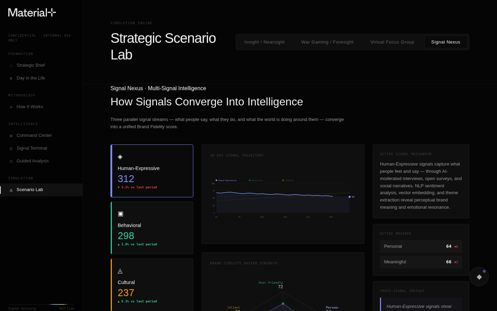
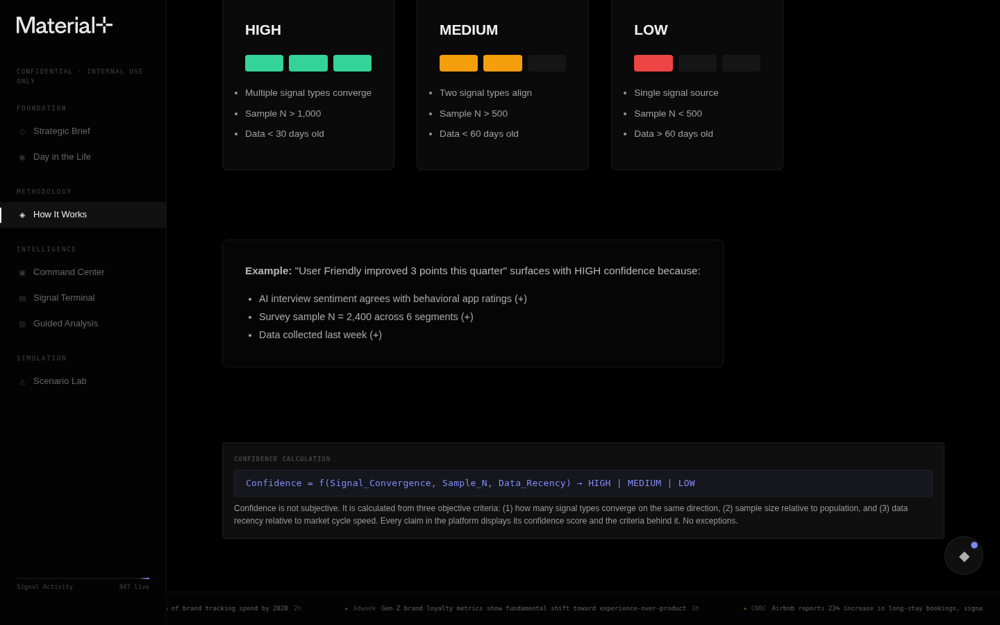
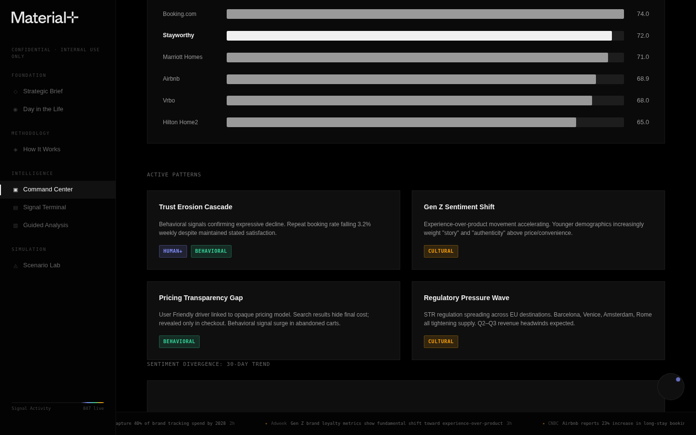

# Brand Intelligence Engine v9

**A multi-signal brand intelligence platform that continuously monitors, analyzes, and surfaces brand health insights — built for the March 19, 2026 board presentation.**

> Every claim has a source. Every source has a confidence score. Every score has a methodology. **Glass Box, Not Black Box.**


---

## What This Is

The Brand Intelligence Engine (BIE) replaces traditional quarterly brand tracking with a **continuous, multi-signal intelligence system**. It ingests three parallel signal streams — what people *say* (Human-Expressive), what people *do* (Behavioral), and what the world *does around them* (Cultural) — and synthesizes them into a unified Brand Fidelity score across six loyalty drivers.

This repo contains the **interactive prototype** — 7 interconnected HTML surfaces that demonstrate the platform's architecture, data model, and UX vision using Stayworthy (fictional short-term rental brand) as the client case.

### Three Things That Set This Apart

1. **Multi-Signal Intelligence** — We don't ask "what do you think?" and stop. We triangulate what people say, what they do, and what the world is doing around them.
2. **Continuous Learning** — Not quarterly waves. Not annual studies. A system that learns every day, surfaces what matters now.
3. **Glass Box Transparency** — Every claim traces to a named source, a documented methodology, and a confidence score. No exceptions.

---

## Surfaces

| Surface | File | Purpose |
|---------|------|---------|
| **Strategic Brief** | `index.html` | Executive overview — the case for reinvention |
| **Day in the Life** | `day-in-the-life.html` | Cinematic scrollytelling — 6 moments from dawn to midnight |
| **How It Works** | `how-it-works.html` | Glass Box methodology — architecture, confidence, sources, framework |
| **Command Center** | `command-center.html` | Morning intelligence brief — BF composite, radar, alerts, patterns |
| **Signal Terminal** | `signal-terminal.html` | Live signal feed — filterable by type, severity, brand |
| **Guided Analysis** | `guided-analysis.html` | AI-assisted analysis — structured questions, driver exploration |
| **Scenario Lab** | `scenario-lab.html` | Simulation engine — funnels, war gaming, focus groups, Signal Nexus |

---

## Screenshots

<details>
<summary>Signal Nexus — How Signals Converge Into Intelligence</summary>


</details>

<details>
<summary>How It Works — Glass Box Architecture</summary>


</details>

<details>
<summary>Confidence Scoring — HIGH / MEDIUM / LOW</summary>


</details>

<details>
<summary>Signal Terminal — Live Feed</summary>


</details>

<details>
<summary>Guided Analysis</summary>


</details>

<details>
<summary>Competitive Landscape + Active Patterns</summary>


</details>

---

## Quick Start

```bash
# Clone the repo
git clone git@github.com:carlton-material/bie-v9.git
cd bie-v9

# Serve locally (any static server works)
python3 -m http.server 8090

# Open in browser
open http://localhost:8090
```

No build step. No dependencies. Pure HTML/CSS/JS.

---

## Architecture

```
bie-v9/
├── index.html                 # Strategic Brief (entry point)
├── day-in-the-life.html       # Cinematic scrollytelling
├── how-it-works.html          # Glass Box methodology (6 inline panels)
├── command-center.html        # Morning intelligence brief
├── signal-terminal.html       # Live signal feed
├── guided-analysis.html       # AI-assisted analysis
├── scenario-lab.html          # Simulation engine (4 tabs)
├── css/
│   ├── tokens.css             # Design tokens — colors, fonts, spacing
│   ├── global.css             # Layout, nav, typography, ticker
│   ├── components.css         # Cards, badges, charts, panels
│   └── glass-box.css          # Glass Box transparency system
├── js/
│   └── app.js                 # Shared behaviors — nav, analyst, Glass Box
├── data/
│   ├── stayworthy.json        # Client brand data
│   ├── signals-metadata.json  # Signal source definitions
│   └── synthetic-cohorts.json # Simulation cohort data
├── assets/
│   └── logos/                 # Brand marks
└── docs/
    └── screenshots/           # QA captures for reference
```

### Design System

- **6-tier black stack**: `#000000` → `#030303` → `#050505` → `#0a0a0a` → `#0f0f0f` → `#141414`
- **3 signal colors ONLY**: Human-Expressive `#818cf8` · Behavioral `#34d399` · Cultural `#f59e0b`
- **3-font system**: Space Grotesk (display) · Inter (body) · JetBrains Mono (data/labels)
- **Brand purple** `#745AFF`: Logo accent only — never used for data

### Data Model

**Brand Fidelity — 6 Drivers of Loyalty**

| Dimension | Driver | Score | Δ |
|-----------|--------|-------|---|
| In the Moment | User Friendly | 72 | -4 |
| In the Moment | Personal | 64 | -8 |
| In the Moment | Accessible | 71 | +1 |
| Over Time | Dependable | 58 | -6 |
| Over Time | Meaningful | 66 | -3 |
| Over Time | Salient | 74 | +2 |
| **Composite** | | **72** | **-4** |

**Signal-to-Driver Mapping**
- Human-Expressive → Personal, Meaningful
- Behavioral → User Friendly, Dependable
- Cultural → Salient, Accessible

**Source Tier Weightage**: Primary 40% · Secondary 30% · Tertiary 20% · Internal 10%

---

## Design Principles

Informed by our R&D architecture discussions, this project embodies:

### Pits of Success
> "Creating a process that allows people to succeed even despite themselves."

The codebase uses shared CSS tokens, a single JS module (`app.js`), and consistent HTML patterns so any surface can be extended without breaking others. New surfaces follow the same template: import the 4 CSS files, import `app.js`, wrap content in `.app > .sidebar + .app-content`.

### Context Rot Prevention
> "When the context grows too big... it leads to the hallucinations you were trying to avoid."

Each surface is self-contained in a single HTML file with inline `<style>` for page-specific CSS. Shared system styles live in `css/`. Data lives in `data/`. No build pipeline to rot. No framework versions to drift. The simplest possible architecture that could work.

### Atomic Units of Implementation
Every feature maps to a discrete, verifiable unit: one Glass Box panel, one Scenario Lab tab, one signal filter. Each can be tested independently. Each has clear acceptance criteria visible in the UI itself.

---

## TODO

### Next Sprint — UI/UX Overhaul
- [ ] Scrape Material+ case studies for storytelling/layout inspiration
- [ ] Elevate Strategic Brief with editorial storytelling modules
- [ ] Refine micro-interactions and hover states across all surfaces
- [ ] Add onboarding flow persistence (localStorage)
- [ ] Responsive breakpoints for tablet presentation mode

### Growth Vectors
- [ ] **Live data integration** — Connect to real APIs (social listening, web analytics, CRM)
- [ ] **Client configurability** — Driver weights, signal sources, alert thresholds
- [ ] **Export engine** — PDF briefs, PPTX decks, scheduled email digests
- [ ] **Multi-brand support** — Compare brands within a category
- [ ] **AI narrative generation** — LLM-powered insight summaries with citations
- [ ] **Scenario simulation backend** — Monte Carlo + agent-based modeling

### Inspirations
- [Rare Volume](https://rarevolume.com) — Data visualization, cinematic data storytelling
- [Material+ Case Studies](https://www.materialplus.io/case-study/) — Editorial storytelling, layout modules
- [Observable](https://observablehq.com) — Interactive data exploration
- [Stripe Press](https://press.stripe.com) — Premium editorial web design

---

## Contributing

### Branch Conventions
```
feature/descriptive-name    # New features
fix/issue-description       # Bug fixes
refine/surface-name         # Visual refinements
sprint/sprint-number        # Sprint bundles
```

### Commit Message Format
```
type(scope): description

feat(signal-nexus): add 3-panel layout with trajectory charts
fix(command-center): correct BF composite count-up animation
refine(ditl): elevate scroll-triggered scene reveals
docs(readme): add architecture section and screenshots
```

### PR Checklist
- [ ] Zero JS console errors across all 7 surfaces
- [ ] All Glass Box toggles functional
- [ ] All navigation links work
- [ ] Screenshots updated if UI changed
- [ ] No API keys, tokens, or secrets committed

---

## Team

**Material+ Applied AI** — R&D / Innovation

Built as a demonstration of what continuous brand intelligence could look like when you combine multi-signal data, transparent methodology, and modern UI/UX design.

---

*Confidential — Internal Use Only*
